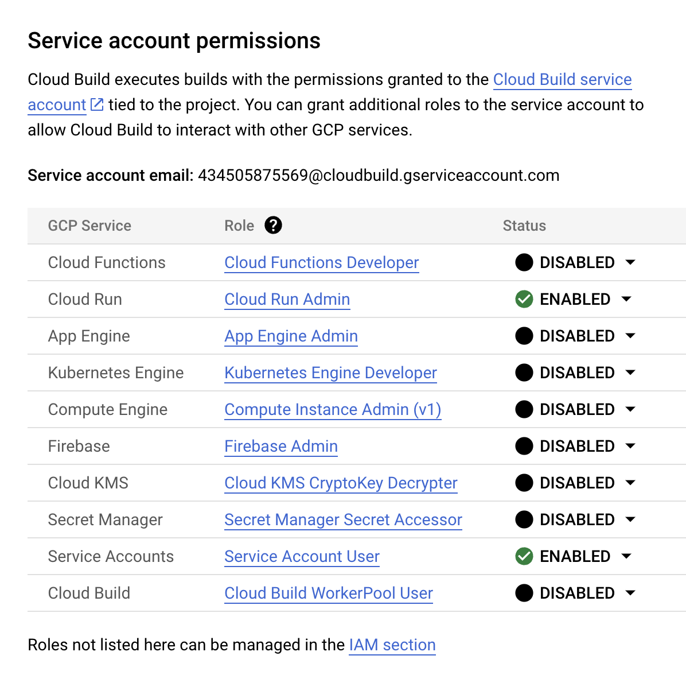

## Google Cloud Setup

### Requirements

- A clone/fork of this project
- At minimum one Google Cloud project as deployment targets. If you have two projects, you can split the testing and review app from your prodcuction workload.
- Enable the Cloud Build, Cloud Run, Container Registry, and Resource Manager APIs in all Google Cloud projects: [Enapble APIs](https://console.cloud.google.com/flows/enableapi?apiid=cloudbuild.googleapis.com,run.googleapis.com,containerregistry.googleapis.com,cloudresourcemanager.googleapis.com)
- Assig IAM permissions to Clouduild ervice Account in all Google Cloud projects: [Go to the Cloud Build settings page](https://console.cloud.google.com/cloud-build/settings) and enable "Cloud Run Admin". In the *Additional steps may be required* pop-up, click *GRANT ACCESS TO ALL SERVICE ACCOUNTS*.
The result should look like this:

- Create a service account for google Cloud Build to be used by GitLab. Goto [IAM & Admin > Service Accounts](https://console.cloud.google.com/iam-admin/serviceaccounts), select your project and click *+ Create Service Account*. Choose a name and select the role *Cloud Build Service Agent*. Under *Actions* -> *Manage Keys* create a new JSON key by clicking *ADD KEY*. Download the created json file, you will later have to store the content of this file in a GitLab variable.
- Create another service account for Google Container Registry (depreceated, will be replaced by Google Artifact Registry). Goto [IAM & Admin > Service Accounts](https://console.cloud.google.com/iam-admin/serviceaccounts), select your project and click *+ Create Service Account*. Choose a name and select the role *Storage Admin* plus *Container Analysis Admin*. Under *Actions* -> *Manage Keys* create a new JSON key by clicking *ADD KEY*. Download the created json file, you will later have to store the content of this file in a GitLab variable.
- After the first run of the ci/cd pipeline, check the created service in [Google Coud Run](https://console.cloud.google.com/run). 
- (Optional) For local debugging purpose, install the [Google Cloud CLI](https://cloud.google.com/sdk)
