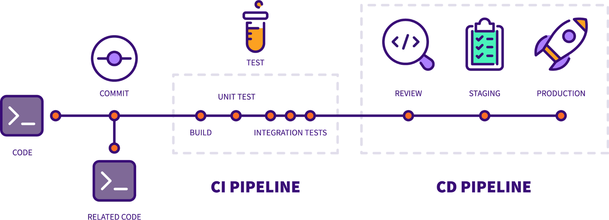

<!-- _footer: 'All as of 2022-07-09 and based on https://about.gitlab.com/company/' -->

# Introduction

## COMPANY

- Open source project since 2011
- Incorporated in 2014 
- 1588 remote team members

## BROAD ADOPTION

- 100,000+ organizations
- Millions of users
- 70% share of self-managed DevOps repository market

## STRONG COMMUNITY

- Open source model 
- 2,000+ code contributors
- 10,000+ total contributors

---

# Continuous Methodologies

---

# CI/CD: From an Issue to a Merge Request

