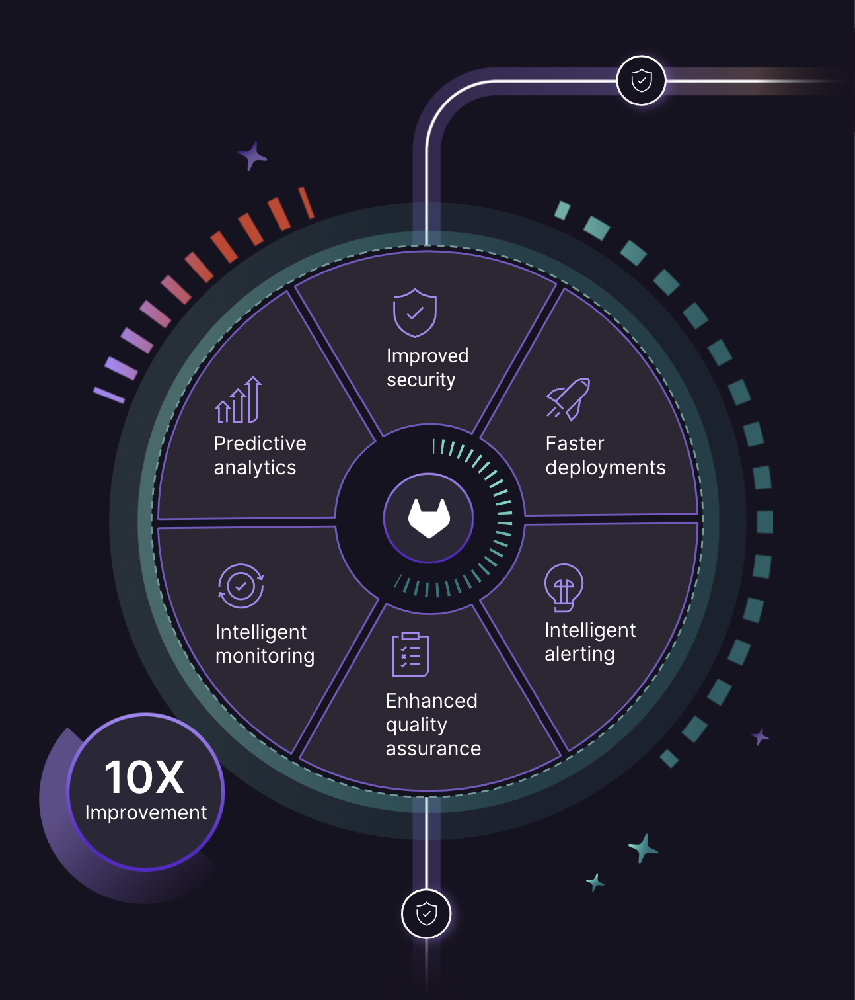

    <h1 style="margin-top:1em;text-align:right">
      GitLab Duo AI Introduction & Demo, 2023-10-30
    </h1>
    <h2 style="margin-bottom:1.5em;text-align:right;color:#FF9900">
      Teammeeting DD-West, Hugo-Junkers-Halle, MG,
    </h2>
    

        

            

                
            

            

                <h2>
                    Christoph Leygraf
                </h2>
                <a href= "mailto:cleygraf@gitlab.com">cleygraf@gitlab.com</a>
            

        

        

        

    

---
<!-- header: ""  --> 

---

Cars?

---

---

---
<!-- header: "" -->

And Software?

<!-- footer:  -->
---
<!-- header: "GitLab's Software Factory Approach" -->

- Ideas go in, applications come out
- Shift security left: checks at each stage
- Full visibility from planning to production

<!-- footer:  -->
---
<!-- header: ""  --> 

---
<!-- header: "" -->

Code Suggestions

<!--
Reference:
- [Supported coding languages](https://cloud.google.com/vertex-ai/docs/generative-ai/code/code-models-overview#supported_coding_languages) 
- For code completion the `code-gecko` code model is required.
-->
<!-- footer:  -->
---
<!-- header: "" -->

39%

<!--
39% of time spending working with code / 52 minutes of code time per day

Sources (as of May 3rd 2023):
- https://tidelift.com/subscription/managed-open-source-survey?utm_source=thenewstack&utm_medium=website&utm_content=inline-mention&utm_campaign=platform
- https://www.software.com/reports/code-time-report#developers-code-less-than-one-hour-per-day-
-->
<!-- footer:  -->
---
<!-- header: "" -->

52 minutes

<!--
39% of time spending working with code / 52 minutes of code time per day

Sources (as of May 3rd 2023):
- https://tidelift.com/subscription/managed-open-source-survey?utm_source=thenewstack&utm_medium=website&utm_content=inline-mention&utm_campaign=platform
- https://www.software.com/reports/code-time-report#developers-code-less-than-one-hour-per-day-
-->
<!-- footer:  -->
---
<!-- header:  "GitLab's AI Vision" -->

---
<!-- header:  "AI powered - in every step & for every user" -->

---
<!-- header: "GitLab's hosting options" -->

- *[SaaS](https://gitlab.com) (provides runners too!)*
- [GitLab Dedicated](https://about.gitlab.com/dedicated/) (in AWS region of choice)
- [Self-managed](https://about.gitlab.com/install/) (on-prem or any cloud, runners need to be provided by you)

 

[Free tier (SaaS) + Premium and Ultimat Editions](src/talk-track.md)

<!-- footer:  -->
---
<!-- header: "" -->

What is a PaaS?

<!-- footer:  -->
---
<!-- header:  "What is a PaaS?" -->

According to [Wikipedia](https://en.wikipedia.org/wiki/Platform_as_a_service):

> Platform as a service (...) is a category of cloud computing services that allows customers to provision, instantiate, run, and manage a modular bundle comprising a computing platform and one or more applications, without the complexity of building and maintaining the infrastructure typically associated with developing and launching the application(s), and to allow developers to create, develop, and package such software bundles.

<!-- footer:  -->
---

According to [Wikipedia](https://en.wikipedia.org/wiki/Platform_as_a_service):

> Platform as a service (...) is a category of cloud computing services that allows customers to provision, instantiate, run, and manage a modular bundle comprising a computing platform and one or more applications, without the complexity of building and maintaining the infrastructure typically associated with developing and launching the application(s), and to allow developers to create, develop, and package such software bundles.

WRONG!!!

<!-- footer:  -->
---
<!-- header:  "For today it's ..." -->

    

        <h2><b>P</b>resentation</h2>
        <h2><b>a</b>s</h2>
        <h2><b>a</b></h2>
        <h2><b>S</b>ervice</h2>
    

<!-- footer:  -->
---
<!-- header:  "Production PaaS App" -->

<!-- footer: ##URL_PROD## --->
---
<!-- header:  "Goal: Fix my mistake" -->

<!-- footer:  -->
---
<!-- header:  "Concept" -->

- This is a demo and **not meant for production**!
- It is build to be **educational**, not show how smart (rather how dumb) I am ;-)
- I like to show **how easy GitLab interacts with the native tooling of various cloud providers** (GitLab alone, Google Cloud, AWS).
- I am aiming for teaching ideas and **concepts, not the details**. 
- As a side kick this is just a playground for me to show off cool stuff.
- **No knowledge of GitLab or of a programming language** is required. Only basic understanding of software development concepts and cloud technologies is necessary.

<!-- footer:  -->
---
<!-- header:  "Design decisions" -->

- Keep it as simple as possible (**KISS** principle).
- Make it **only as secure as needed for a demo**.
- **Share it with the public**, but BYOI.
- Uses **simple text files with markdown** instead of a programming language like rust, go, ... .

<!-- footer: https://gitlab.com/gitlab-partner-demos/paas/paas --->
---
<!-- header:  "Demo Project" -->

<!-- footer: https://gitlab.com/gitlab-partner-demos/paas/paas --->
---
<!-- header:  "Architecture - AWS" -->

- GitLab SaaS (with runners)
- AWS EKS with GitLab runners using IRSA (**I**AM **R**oles for **S**ervice **A**ccounts)
- AWS ECR (**E**lastic **C**ontainer **R**egistry)
- AWS Fargate (Serverless Compute Engine)

<!-- footer:  -->
---
<!-- header:  "Architecture - Google Cloud" -->

- GitLab SaaS (with runners and GitLab SAST)
- Google Cloud Build
- Google Container Registry 
- Google Cloud Run

<!-- footer:  -->
---
<!-- header:  "Architecture - GitLab" -->

- GitLab SaaS (with runners)
- GitLab Pages

 

Works with a trial license!

<!-- footer:  -->
---
<!-- header:  "Prerequisits - AWS" -->

- GitLab SaaS (with runners)
- An AWS EKS cluster (OIDC enabled)
- Roles, policies, service accounts and namespaces for the EKS cluster to use by IRSA
- GitLab runners on EKS (GitLab provided helm chart with a custom `values.yaml` file in this repository)
- ECS Fargate with two services, load balancers and task definitions 

 
 

Explanations on how to set up the AWS infrastructure are in `./infra/aws/README.MD`

<!-- footer:  -->
---
<!-- header:  "AWS: IRSA" -->

[IAM roles for service accounts](https://docs.aws.amazon.com/eks/latest/userguide/iam-roles-for-service-accounts.html)

 

> Applications in a Pod's containers can use an AWS SDK or the AWS CLI to make API requests to AWS services using AWS Identity and Access Management (IAM) permissions. ... Instead of creating and distributing your AWS credentials to the containers or using the Amazon EC2 instance's role, you associate an IAM role with a Kubernetes service account and configure your Pods to use the service account. ...

<!-- footer:  -->
---
<!-- header:  "AWS: Infrastructure Architecture" -->

<!-- footer:  -->
---
<!-- header:  "GitLab Workflow: Introduction" -->

---
<!-- header:  "GitLab Groups and Projects" -->

- Groups
  - Variables
  - Runners
  - Epics
  - Projects
    - Variables
    - Runners
    - Issues
    - Repository

<!-- footer:  -->
---
<!-- header:  "GitLab Workflow: Issue, MR, Push Code, Pipeline" -->

---
<!-- header:  "GitLab Pipeline - Stages and jobs" -->

- prechecks
  - markdownlint
- build
  - create-qr
  - generate-deck
  - build-container (tags: aws)
- test
  - kics-iac-sast
- review
  - review (tags: aws)
- deploy
  - deploy-prod

<!-- footer:  -->
---
<!-- header:  "GitLab Workflow: Preview App" -->

---
<!-- header:  "Review PaaS App" -->

<!-- footer: ##URL_REVIEW## --->
---
<!-- header:  "Production PaaS App" -->

 

<!-- footer: ##URL_PROD## --->
---
<!-- header:  "Improvements to consider" -->

- Alternative: Use Fargate with associated IAM roles instead of EKS
- Add SAST container scanning or ECR Image scanning
- More granular permissions

<!-- footer:  -->
---
<!-- header:  "" -->

    <h2>
        Thank you!
    </h2>
     
    <h4>
        Friendly reminder: from now on, <b>PaaS</b> is <i><b>P</b>resentation <b>a</b>s <b>a</b> <b>S</b>ervice.</i>
    </h4>

<!-- footer: "https://about.gitlab.com/" -->
---
<!-- header:  "Useful links?" -->

 [GitLab 2023 Global DevSecOps Report Series](https://about.gitlab.com/developer-survey/)

 [GitLab Duo](https://about.gitlab.com/gitlab-duo/)

 [AI/ML in DevSecOps Series](https://about.gitlab.com/blog/2023/04/24/ai-ml-in-devsecops-series/)

 [GitLab and Google Cloud AI Partnership](https://about.gitlab.com/press/releases/2023-05-02-gitLab-and-google-cloud-partner-to-expand-ai-assisted-capabilities.html)

 [GitLab on Google Cloud](https://about.gitlab.com/partners/technology-partners/google-cloud-platform/)

 [... even more GitLab related links](./links.html)

<!-- footer:  -->
---
<!-- header:  "<b>Updated</b> Production PaaS App" -->

<!-- footer: Still the same URL: ##URL_PROD## --->
---
