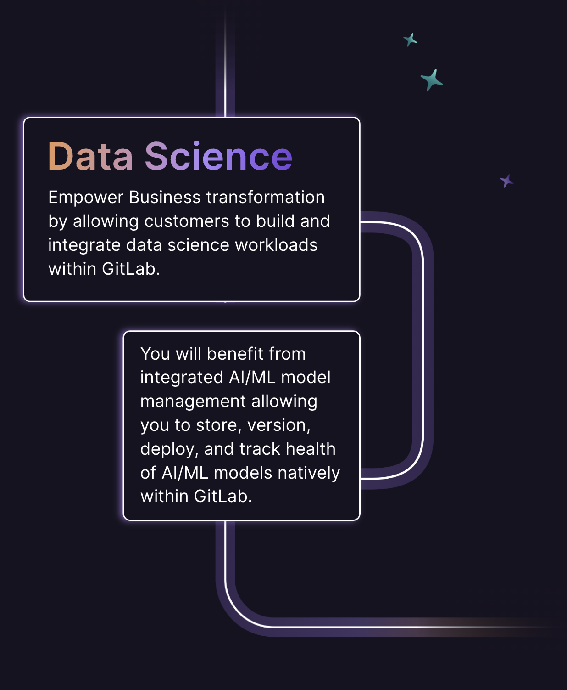
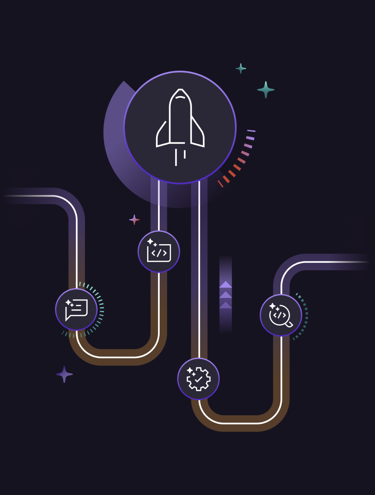
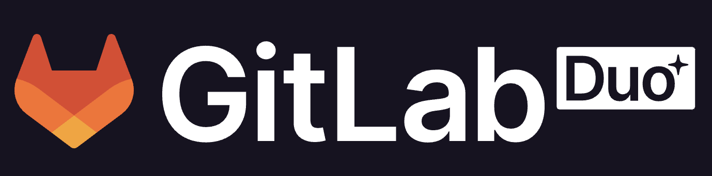

    <h1 style="margin-top:1em;text-align:right">
      GitLab Duo AI Introduction & Demo, 2024-11-02
    </h1>
    <h2 style="margin-bottom:1.5em;text-align:right;color:#FF9900">
      Sue B.V. - Geldermalsen
    </h2>
    

        

            

                
            

            

                <h2>
                    Christoph Leygraf
                </h2>
                <a href= "mailto:cleygraf@gitlab.com">cleygraf@gitlab.com</a>
            

        

        

        

    

---
<!-- header: ""  --> 

---

<!-- header: "Disclaimer"  --> 

This presentation and linked pages contain information related to upcoming products, features, and functionality. 

It is important to note that the information presented is for informational purposes only. Please do not rely on this information for purchasing or planning purposes. 

As with all projects, the items mentioned in this presentation and linked pages are subject to change or delay. The development, release, and timing of any products, features, or functionality remain at the sole discretion of GitLab Inc.

<!-- footer:  -->
---

Cars?

---

---

---
<!-- header: "" -->

And Software?

<!-- footer:  -->
---
<!-- header: "GitLab's Software Factory Approach" -->

- Ideas go in, applications come out
- Shift security left: checks at each stage
- Full visibility from planning to production

<!-- footer:  -->
---
<!-- header: ""  --> 

---
<!-- header: "" -->

Code Suggestions

<!--
Reference:
- As of Nov 2023 14 coding languages are supported
- [Supported coding languages](https://cloud.google.com/vertex-ai/docs/generative-ai/code/code-models-overview#supported_coding_languages) 
- For code completion the `code-gecko` code model is required.
-->
<!-- footer:  -->
---
<!-- header: "" -->

39%

<!--
39% of time spending working with code / 52 minutes of code time per day

Sources (as of May 3rd 2023):
- https://tidelift.com/subscription/managed-open-source-survey?utm_source=thenewstack&utm_medium=website&utm_content=inline-mention&utm_campaign=platform
- https://www.software.com/reports/code-time-report#developers-code-less-than-one-hour-per-day-
-->
<!-- footer:  -->
---
<!-- header: "" -->

52 minutes

<!--
39% of time spending working with code / 52 minutes of code time per day

Sources (as of May 3rd 2023):
- https://tidelift.com/subscription/managed-open-source-survey?utm_source=thenewstack&utm_medium=website&utm_content=inline-mention&utm_campaign=platform
- https://www.software.com/reports/code-time-report#developers-code-less-than-one-hour-per-day-
-->
<!-- footer:  -->
---
<!-- header:  "GitLab's AI Vision" -->

 Throughout the Software Delivery Lifecycle
 Privacy and transparency first  
 Single Application

---
<!-- header:  "AI powered - in every step & for every user" -->

<!-- footer: "" -->
---
<!-- header:  "Dogfooding" -->

<!--
References: 
- [Dogfooding for Product Managers](https://about.gitlab.com/handbook/product/product-processes/dogfooding-for-product-mgt/)
- [Engineering Principles - Dogfooding](https://about.gitlab.com/handbook/engineering/development/principles/#dogfooding)
-->
<!-- footer: "" -->
---
<!-- header:  "DYOC" -->

<!-- footer: "" -->
---
<!-- header:  "PaaS" -->

    

        <h2><b>P</b>resentation</h2>
        <h2><b>a</b>s</h2>
        <h2><b>a</b></h2>
        <h2><b>S</b>ervice</h2>
    

<!-- footer:  -->
---
<!-- header:  "Live demo - Slides" -->

<!-- footer: "##URL_AI_PROD##" -->
---
<!-- header:  "Live demo - GitLab Project" -->

<!-- footer: "##URL_PROJ##" -->
---
<!-- header:  "Flow of demo" -->

<!-- footer: "" -->
---
<!-- header:  "Generate issue description" -->

Demo

<!-- footer: "Hint: Use 'Fix typo on first slide: replace 2024 with 2023 and use markdown' to generate description." -->
---
<!-- header:  "Code Suggestions" -->

Demo

<!-- footer: "Hint: Use '# Iterate over the directory ./src and print filenames in another file' to generate code." -->
---
<!-- header:  "Explain this code" -->

Demo

<!-- footer: "Hint: View '.gitlab-ci.yml' file, select code and click '?'" -->
---
<!-- header:  "Explain this vulnerability" -->

Demo

<!-- footer: "Hint: Go to 'Secure' -> 'Vulnerability report', select a vulnerability and click 'Explain vulnerability'." -->
---
<!-- header:  "Summarize MR review" -->

Demo

<!-- footer: "Hint: Open a MR, go to 'Commits' and select 'View summary notes' form three dots." -->
---
<!-- header:  "GitLab AI Roadmap:" -->

# ModelOps

<!-- footer: "" -->
---
<!-- header:  "" -->

## AI-assisted workflows to empower **every user at every step**

 Understand Epics and Issues faster
 Understand code easier  
 Write better code more efficiently
 Have better code reviews
 Automate those repetitive tasks 

<!-- footer: "" -->
---
<!-- header:  "" -->

## AI-assisted workflows to empower **every user at every step**

 Understand Epics and Issues faster
 Understand code easier  
 Write better code more efficiently
 Have better code reviews
 Automate those repetitive tasks 

---
<!-- header:  "" -->

# Thank you!

<!-- footer: "https://about.gitlab.com/" -->
---
<!-- header:  "Useful links?" -->

 [GitLab Duo](https://about.gitlab.com/gitlab-duo/)

 [GitLab Duo - Documentation](https://docs.gitlab.com/ee/user/gitlab_duo_chat.html)

 [The state of AI in software development](https://about.gitlab.com/developer-survey/#ai)

 [GitLab Global DevSecOps AI Report: Ushering in a new era of software development](https://about.gitlab.com/blog/2023/09/12/gitlab-global-devsecops-ai-report/)

 [... even more GitLab related links](./links.html)

<!-- footer:  -->
