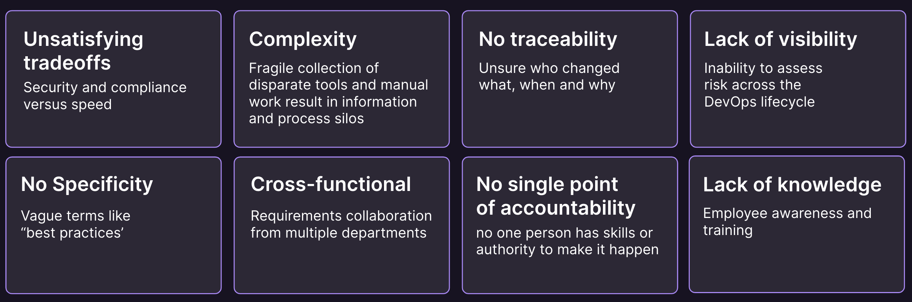

    <h1 style="margin-top:1em;text-align:right;color:#fc6d27">
      ##COMPLIANCE_TITLE##
    </h1>
    <h2 style="margin-bottom:1.5em;text-align:right;">
      ##SUBTITLE##
    </h2>
    

        

            

                
            

            

                <h2>
                    Christoph Leygraf
                </h2>
                <a href= "mailto:cleygraf@gitlab.com">cleygraf@gitlab.com</a>
            

        

        

        

    

<!-- footer: "" -->
---

Compliance? Really?

---
<!-- header: "Compliance?" -->

“In general, compliance means conforming to a rule, such as a specification, policy, standard or law. …”

[Wikipedia](https://en.wikipedia.org/wiki/Regulatory_compliance)

<!-- footer:  -->
---
<!-- header: "Really?" -->

In 2023?

<!-- footer:  -->
---
<!-- header:  "Really?" -->

<!-- footer:  -->
---
<!-- header:  "Why is compliance so hard to achieve" -->

<!-- footer:  -->
---
<!-- header:  "A platform approach can cut through the complexity" -->

<!-- footer:  -->
---
<!-- header:  "" -->

# Thank you

<!-- footer: "" -->
