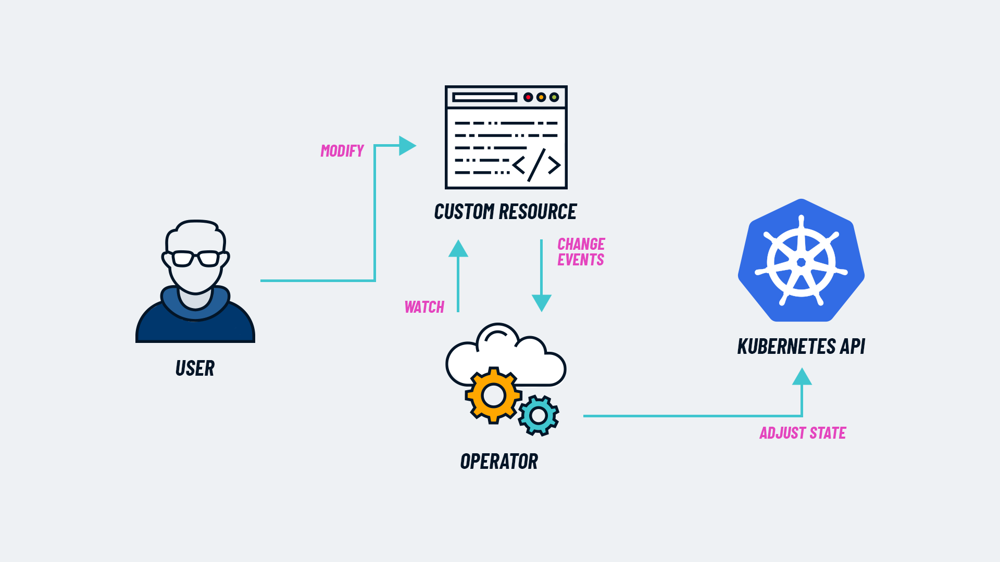

    <h1 style="margin-top:1em;text-align:right">
      GitLab Operator - Brussels
    </h1>
    <h2 style="margin-bottom:1.5em;text-align:right;color:#FF9900">
      Technical Partner Community Meetup, 2024-10-19
    </h2>
    

        

            

                
            

            

                <h2>
                    Christoph Leygraf
                </h2>
                <a href= "mailto:cleygraf@gitlab.com">cleygraf@gitlab.com</a>
            

        

        

        

    

---
<!-- header: "Agenda" -->

- Warm-up
- Introduction to GitLab
- Why Operators?
- GitLab Operator
- GitLab Runner Operator

<!-- footer:  -->
---
<!-- header:  "" -->

Warm-up

<!-- footer:  -->
---
<!-- header:  "Please vote:" -->

 
 

<h2 class="center"> OpenShift vs. other k8s flavors</h2>

<!-- footer:  -->
---
<!-- header:  "Please vote:" -->

## k8s/osp: on-prem vs. cloud/hosted

<!-- footer:  -->
---
<!-- header:  "Please vote:" -->

## GitLab vs. GitHub vs. nothing 

<!-- footer:  -->
---
<!-- header:  "Please vote:" -->

## GitLab: self-managed vs. SaaS 

<!-- footer:  -->
---
<!-- header:  "Please vote:" -->

## GitLab self-managed: OpenShift

<!-- footer:  -->
---
<!-- header:  "Slides online" -->

<!-- footer: ##URL_OPERATOR_PROD## --->
---
<!-- header: ""  --> 

---

Cars?

---

---

---
<!-- header: "" -->

And Software?

<!-- footer:  -->
---
<!-- header: "GitLab's Software Factory Approach" -->

- Ideas go in, applications come out
- Shift security left: checks at each stage
- Full visibility from planning to production

<!-- footer:  -->
---
<!-- header: ""  --> 

---
<!-- header:  "AI powered - in every stage & for everyone" -->

---
<!-- header: "GitLab's hosting options" -->

- *[SaaS](https://gitlab.com) (provides runners too!)*
- [GitLab Dedicated](https://about.gitlab.com/dedicated/) (in AWS region of choice)
- [Self-managed](https://about.gitlab.com/install/) (on-prem or any cloud, runners need to be provided by you)

[Free tier (SaaS) + Premium and Ultimat Editions](src/talk-track.md)

<!-- footer:  -->
---
<!-- header: "Why Operators?"  --> 

According to [kubernetes.io](https://kubernetes.io/docs/concepts/extend-kubernetes/operator/):

> Operators are software extensions to Kubernetes that make use of **custom resources** to manage applications and their components. Operators follow Kubernetes principles, notably the **control loop**.

 

(Highlights by me)

---
<!-- header: "Why Operators?"  --> 

<!-- footer: Image from (CNCF)[https://www.cncf.io/blog/2022/06/15/kubernetes-operators-what-are-they-some-examples/]  --->
---
<!-- header: "Why Operators?"  --> 

- Cloud native way of installing an app into k8s
- Taking care of the complete app lifecycle
- Perfect fit for OpenShift: managed through webui or cli

<!-- footer:  -->
---
<!-- header: "Demo time"  --> 

## Install GitLab Operator

<!-- footer:  -->
---
<!-- header: "Demo time"  --> 

## Install GitLab with the Operator

<!-- footer:  -->
---
<!-- header: "How to install GitLab on k8s"  --> 

- With GitLab's helm chart
- With the GitLab operator
  - Sadly: not recommended for production yet ([docs](https://docs.gitlab.com/operator/installation.html))
  - Expected for selected use cases soon ([epic](https://gitlab.com/groups/gitlab-org/-/epics/10968))
  - Aiming for near zero-downtime upgrade

<!-- footer:  -->
---
<!-- header: "Prerequisites"  --> 

- cert-manager
- Ingress
  - OpenShift routes
  - NGINX ingress
  
<!-- footer:  -->
---
<!-- header: "Updates"  --> 

- Update the operator ([docs](https://docs.gitlab.com/operator/operator_upgrades.html))
- Update GitLab ([docs](https://docs.gitlab.com/operator/gitlab_upgrades.html))
  
<!-- footer:  -->
---
