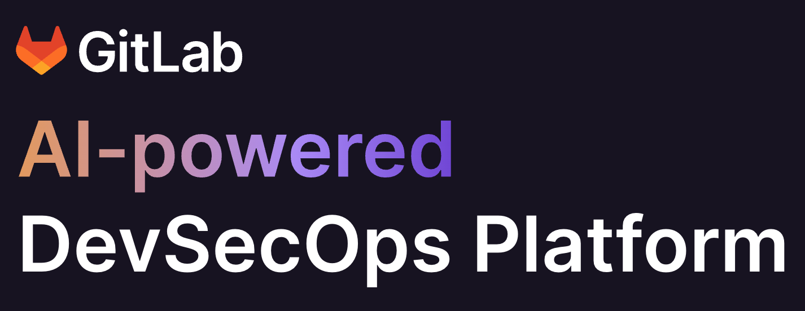
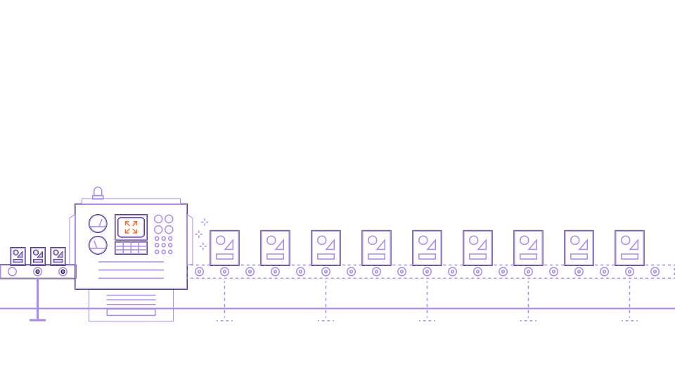
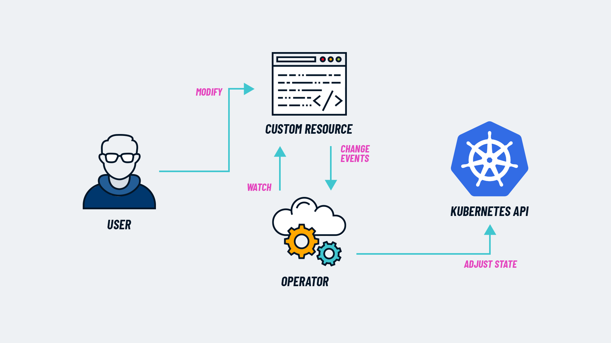

    <h1 style="margin-top:1em;text-align:right">
      GitLab Operators
    </h1>
    <h2 style="margin-bottom:1.5em;text-align:right;color:#FF9900">
      Technical Partner Community Meetup 
      Brussels, 2023-10-19
    </h2>
    

        

            

                
            

            

                <h2>
                    Christoph Leygraf
                </h2>
                <a href= "mailto:cleygraf@gitlab.com">cleygraf@gitlab.com</a>
            

        

        

        

    

---
<!-- header: "Agenda" -->

- Warm-up
- Introduction to GitLab
- GitLab Operator
- GitLab Runner Operator

<!-- footer:  -->
---
<!-- header:  "" -->

Warm-up

<!-- footer:  -->
---
<!-- header:  "Please vote:" -->

 
 

<i>OpenShift vs. other k8s flavors</i>

<!-- footer:  -->
---
<!-- header:  "Please vote:" -->

 
 

<i>k8s/osp: on-prem vs. cloud/hosteds</i>

<!-- footer:  -->
---
<!-- header:  "Please vote:" -->

 
 

<i>GitLab vs. GitHub vs. nothing</i>

<!-- footer:  -->
---
<!-- header:  "Please vote:" -->

 
 

<i>GitLab: self-managed vs. SaaS</i>

<!-- footer:  -->
---
<!-- header:  "Please vote:" -->

 
 

<i>GitLab self-managed: OpenShift</i>

<!-- footer:  -->
---
<!-- header:  "Slides online" -->

<!-- footer: ##URL_OPERATOR_PROD## --->
---
<!-- header:  "" -->

Introduction to GitLab

<!-- footer:  -->
---
<!-- header: ""  --> 

---

Cars?

---

---

---
<!-- header: "" -->

And Software?

<!-- footer:  -->
---
<!-- header: "GitLab's Software Factory Approach" -->

- Ideas go in, applications come out
- Shift security left: checks at each stage
- Full visibility from planning to production

<!-- footer:  -->
---
<!-- header: ""  --> 

---
<!-- header:  "AI powered - in every stage & for everyone" -->

---
<!-- header: "GitLab's hosting options" -->

- *[SaaS](https://gitlab.com) (provides runners too!)*
- [GitLab Dedicated](https://about.gitlab.com/dedicated/) (in AWS region of choice)
- [Self-managed](https://about.gitlab.com/install/) (on-prem or any cloud, runners need to be provided by you)

 

[Free tier (SaaS) + Premium and Ultimat Editions](src/talk-track.md)

<!-- footer:  -->
---
<!-- header:  "" -->

GitLab Operator

<!-- footer:  -->
---
<!-- header: "Why Operators?"  --> 

According to [kubernetes.io](https://kubernetes.io/docs/concepts/extend-kubernetes/operator/):

> Operators are software extensions to Kubernetes that make use of **custom resources** to manage applications and their components. Operators follow Kubernetes principles, notably the **control loop**.

 

(Highlights by me)

---
<!-- header: "Why Operators?"  --> 

<!-- footer: Image from <a href="https://www.cncf.io/blog/2022/06/15/kubernetes-operators-what-are-they-some-examples/">CNCF</a> --->
---
<!-- header: "Why Operators?"  --> 

- Cloud native way of installing an app into k8s
- Taking care of the complete app lifecycle
- Perfect fit for OpenShift: managed through webui or cli

<!-- footer:  -->
---
<!-- header: "Demo time"  --> 

Install the GitLab Operator

<!-- footer:  -->
---
<!-- header: "Demo time"  --> 

Install GitLab with the Operator

<!-- footer:  -->
---
<!-- header: "How to install GitLab on k8s?"  --> 

- With GitLab's helm chart
- With the GitLab operator
  - Sadly: not recommended for production yet ([docs](https://docs.gitlab.com/operator/installation.html))
  - Expected for selected use cases soon ([epic](https://gitlab.com/groups/gitlab-org/-/epics/10968))
  - Aiming for near zero-downtime upgrade

<!-- footer:  -->
---
<!-- header: "Prerequisites"  --> 

- cert-manager
- Ingress
  - [OpenShift routes](https://docs.gitlab.com/operator/openshift_ingress.html#openshift-routes)
  - [NGINX ingress](https://docs.gitlab.com/operator/openshift_ingress.html#nginx-ingress-controller)
  
<!-- footer:  -->
---
<!-- header: "Updates"  --> 

- Update the GitLab operator ([docs](https://docs.gitlab.com/operator/operator_upgrades.html))
- Update GitLab ([docs](https://docs.gitlab.com/operator/gitlab_upgrades.html))
  
<!-- footer:  -->
---
<!-- header: "Demo time"  --> 

Access GitLab

<!-- footer:  -->
---
<!-- header: "Demo time"  --> 

Upgrade GitLab

<!-- footer:  -->
---
<!-- header:  "" -->

GitLab Runner Operator

<!-- footer:  -->
---
<!-- header: "Runners?"  --> 

<!-- footer:  -->
---
<!-- header: "Runners?"  --> 

According to [GitLab](https://docs.gitlab.com/runner/):

> GitLab Runner is an application that works with GitLab CI/CD to run jobs in a pipeline ... If you use GitLab.com, you can run your CI/CD jobs on SaaS runners hosted by GitLab ... Alternatively, you can install GitLab Runner and register your own runners on GitLab.com or on your own instance.

<!-- footer:  -->
---
<!-- header: "Prerequisites"  --> 

- GitLab Runner Operator
- GitLab Runner registration token 
  
<!-- footer:  -->
---
<!-- header: "Demo time"  --> 

Install the GitLab Runner Operator

<!-- footer:  -->
---
<!-- header: "Demo time"  --> 

Create Runner Token Secret

<!-- footer:  -->
---
<!-- header: "Demo time"  --> 

Create a runner with the GitLab Runner Operator

<!-- footer:  -->
---
<!-- header:  "" -->

# Thank you

<!-- footer: "" -->
---
<!-- header:  "Useful links?" -->

 [GitLab 2023 Global DevSecOps Report Series](https://about.gitlab.com/developer-survey/)

 [GitLab Duo](https://about.gitlab.com/gitlab-duo/)

 [AI/ML in DevSecOps Series](https://about.gitlab.com/blog/2023/04/24/ai-ml-in-devsecops-series/)

 [GitLab and Google Cloud AI Partnership](https://about.gitlab.com/press/releases/2023-05-02-gitLab-and-google-cloud-partner-to-expand-ai-assisted-capabilities.html)

 [GitLab on Google Cloud](https://about.gitlab.com/partners/technology-partners/google-cloud-platform/)

 [GitLab Case Study](https://cloud.google.com/customers/gitlab)

 [... even more GitLab related links](./links.html)

<!-- footer:  -->
---
