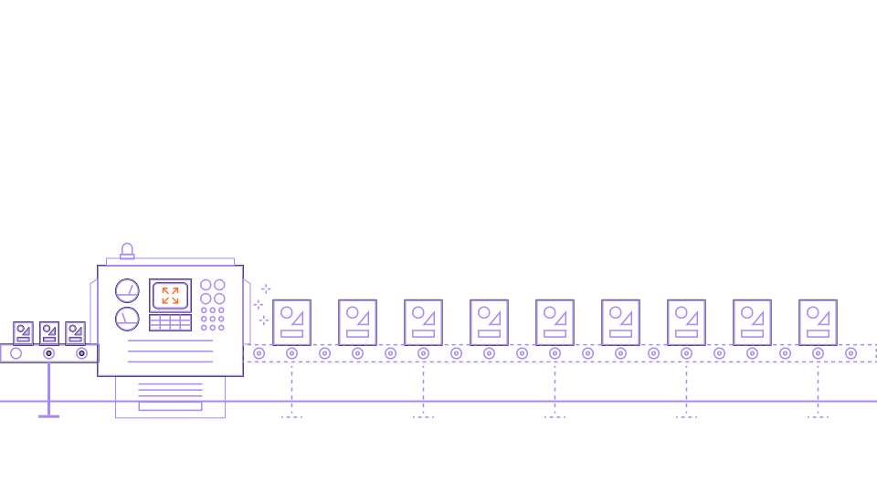
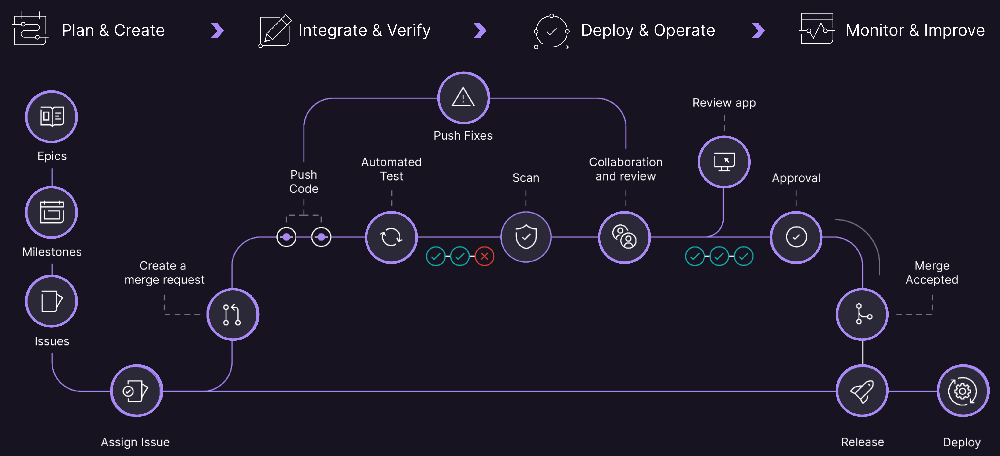

    <h1 style="margin-top:1em;text-align:right">
        GitLab Workshop Stockholm, 2023-09-28
    </h1>
    <h2 style="margin-bottom:1.5em;text-align:right;color:#FF9900">
        <b>AWS</b>
    </h2>
    

        

            

                
            

            

                <h2>
                    Christoph Leygraf
                </h2>
                <a href= "mailto:cleygraf@gitlab.com">cleygraf@gitlab.com</a>
            

        

        

        

    

---
<!-- header: ""  --> 

---

Cars?

---

---

---
<!-- header: "" -->

And Software?

---

<!-- header: "GitLab's Software Factory Approach" -->

- Ideas go in, applications come out
- Shift security left: checks at each stage
- Full visibility from planning to production

---
<!-- header: "" -->

What is a PaaS?

---
<!-- header:  "What is a PaaS?" -->

According to [Wikipedia](https://en.wikipedia.org/wiki/Platform_as_a_service):

> Platform as a service (...) is a category of cloud computing services that allows customers to provision, instantiate, run, and manage a modular bundle comprising a computing platform and one or more applications, without the complexity of building and maintaining the infrastructure typically associated with developing and launching the application(s), and to allow developers to create, develop, and package such software bundles.

---

According to [Wikipedia](https://en.wikipedia.org/wiki/Platform_as_a_service):

> Platform as a service (...) is a category of cloud computing services that allows customers to provision, instantiate, run, and manage a modular bundle comprising a computing platform and one or more applications, without the complexity of building and maintaining the infrastructure typically associated with developing and launching the application(s), and to allow developers to create, develop, and package such software bundles.

WRONG!!!

---
<!-- header:  "For today it's ..." -->

    

        <h2><b>P</b>resentation</h2>
        <h2><b>a</b>s</h2>
        <h2><b>a</b></h2>
        <h2><b>S</b>ervice</h2>
    

---

<!-- header:  "Production PaaS App" -->

<!-- footer: ##URL_PROD## --->

---
<!-- header:  "Concept" -->

- This is a demo and not meant for production!
- It is build to be educational, not show how smart (rather how dumb) I am ;-)
- I like to show how easy GitLab interacts with the native tooling of various cloud providers (GitLab alone, Google Cloud, AWS, Auzure to come).
- I am aiming for teaching ideas and concepts, not the details. 
- As a side kick this is a playground for me to show off cool stuff.
- No knowledge of GitLab or of a programming language is required. Only basic understanding of software development concepts and cloud technologies is necessary.

<!-- footer:  -->
---
<!-- header:  "Concept - Consequences" -->

- Keep it as simple as possible (KISS principle).
- Make it only as secure as needed for a demo.
- Share it with the public, but BYOI.
- Use simple text files with markdown instead of a programming language like rust, go, ... .

---
<!-- header:  "Architecture - AWS" -->

- GitLab SaaS (including runners)
- AWS EKS with GitLab runners using IRSA (IAM Roles for Service Accounts)
- AWS ECR (Elastic Container Registry)
- AWS Fargate (Container )

---
<!-- header:  "Architecture - Google Cloud" -->

- GitLab SaaS (including runners and GitLab SAST)
- Google Cloud Build
- Google Container Registry 
- Google Cloud Run

---
<!-- header:  "Architecture - GitLab" -->

- GitLab SaaS (including runners)
- GitLab Pages

Works with a trial license!

---
<!-- header:  "Architecture" -->

# Prerequisits

- GitLab SaaS (including runners)
- An AWS EKS cluster (OIDC enabled)
- Create roles, policies and configure the EKS cluster to use IRSA (including a service account and namespace)
- Install GitLab runners with the help of the GitLab provided helm chart
- Provide a `values.yaml` file to make the runners use the service account and namespace mentioned before
- ECS fargate configured with two services, load balancers ...

---
<!-- header:  "Goal: GitLab developer work flow" -->

<!-- footer:  -->

---
<!-- header:  "CI/CD Pipeline" -->

# Stages and jobs

- prechecks
  - markdownlint
- build
  - create-qr
  - generate-deck
  - build-container (tags: aws)
- test
  - kics-iac-sast
- review
  - review (tags: aws)
- deploy
  - deploy-prod

---
<!-- header:  "Architecture" -->

# Improvements to consider

- Get IRSA working again ;-) 
- Alternativly use Fargate with associated IAM roles
- Add SAST container scanning or ECR Image scanning
- More granular permissions

---
<!-- header:  "" -->

    <h2>
        Thank you!
    </h2>
     
    <h4>
        Friendly reminder: from now on, <b>PaaS</b> is <i><b>P</b>resentation <b>a</b>s <b>a</b> <b>S</b>ervice.</i>
    </h4>

<!-- footer: "https://about.gitlab.com/" -->
---
<!-- header:  "Useful links?" -->

 [GitLab 2023 Global DevSecOps Report Series](https://about.gitlab.com/developer-survey/)

 [GitLab Duo](https://about.gitlab.com/gitlab-duo/)

 [AI/ML in DevSecOps Series](https://about.gitlab.com/blog/2023/04/24/ai-ml-in-devsecops-series/)

 [GitLab Duo](https://about.gitlab.com/gitlab-duo/)

 [GitLab and Google Cloud AI Partnership](https://about.gitlab.com/press/releases/2023-05-02-gitLab-and-google-cloud-partner-to-expand-ai-assisted-capabilities.html)

 [GitLab on Google Cloud](https://about.gitlab.com/partners/technology-partners/google-cloud-platform/)

 [GitLab Case Study](https://cloud.google.com/customers/gitlab)

 [... even more GitLab related links](./links.html)

<!-- footer: " [These slides as PDF](slides.pdf)" -->

---
<!-- header:  "<b>Updated</b> Production PaaS App" -->

<!-- footer: Still the same URL: ##URL_PROD## --->
