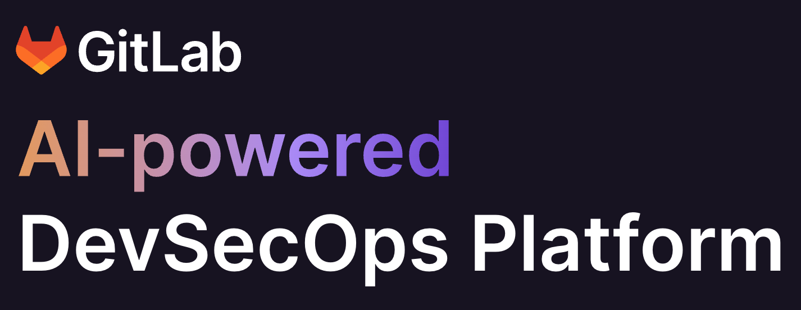

    <h1 style="margin-top:1em;text-align:right">
        git & GitLab
    </h1>
    <h2 style="margin-bottom:1.5em">
        <b>Computacenter DE</b>
    </h2>
    

        

            

                
            

            

                <h2>
                    Christoph Leygraf
                </h2>
                <a href= "mailto:cleygraf@gitlab.com">cleygraf@gitlab.com</a>
            

        

        

<!--             

                
            

            

                <h2>
                    Péter Bozsó
                </h2>
                <a href= "mailto:pbozso@gitlab.com">pbozso@gitlab.com</a>
            
 -->
        

    

---

<!-- header: Agenda --> 

- Introduction, today's goals
- Preface: What's GitLab?
- SCM: git (cli & VS Code)
- GitLab Developer Workflow

---
<!-- header:  --> 

---

Cars?

---

---

---

And Software?

---

<!-- header: "GitLab's Software Factory Approach" -->

- Ideas go in, applications come out
- Shift security left: checks at each stage
- Full visibility from planning to production

---
<!-- header: "What is source code management?" -->

 Source code management (SCM), also known as version control or revision control, is a set of practices and tools used in software development to track and manage changes to source code and other related files. The primary goal of source code management is to enable collaboration among developers working on the same codebase while ensuring the integrity and traceability of the codebase's history.
 
 ...

---

Key aspects of source code management include:

**Version Tracking**: SCM systems track changes made to source code files over time. Each change is recorded as a separate version, allowing developers to view and compare different versions of files.

**Collaboration**: SCM enables multiple developers to work on the same project simultaneously. Developers can create branches (parallel copies) of the codebase to work on specific features or fixes without interfering with each other's work.

...

---

**Change History**: SCM maintains a chronological history of changes made to the codebase. This history includes information about who made the change, what changes were made, and when they were made. This information can be invaluable for debugging, auditing, and understanding the evolution of the codebase.

**Merge and Conflict Resolution**: When developers work on different branches and want to combine their changes, an SCM system helps merge those changes intelligently. In cases where conflicting changes occur (e.g., when two developers modify the same lines of code), the system provides tools to resolve those conflicts.

...

---

**Reverting Changes**: If a change causes problems or introduces bugs, SCM allows developers to revert back to a previous version of the code, effectively undoing problematic changes.

**Code Review**: SCM systems often integrate with code review tools, making it easier for team members to review and discuss proposed changes before they are merged into the main codebase.

...

---

**Backup and Disaster Recovery**: By storing code and its history in a centralized repository or distributed system, SCM provides a form of backup and allows for disaster recovery. If a codebase is lost or corrupted, developers can retrieve previous versions from the SCM system.

**Branching Strategies**: SCM systems support various branching strategies, such as feature branching, release branching, and hotfix branching. These strategies help manage the flow of changes and stabilize code for different stages of development.

...

---

Popular SCM systems include Git, Mercurial, and Subversion. Git, in particular, has gained widespread adoption due to its distributed nature, speed, and powerful branching capabilities. GitHub, GitLab, and Bitbucket are platforms built around Git that provide additional features for hosting and collaborating on repositories.

...

---
<!-- header:  "What is git?" -->

Git is a distributed version control system (DVCS) that was created by Linus Torvalds in 2005. It is widely used for tracking changes in source code during software development and for coordinating work among multiple developers. Git is designed to be fast, efficient, and capable of handling both small and large projects with ease. 

...

---
<!-- header:  "Who invented git?" -->

Git was invented by Linus Torvalds, the same individual who created the Linux operating system. Linus began working on Git in 2005 to address the shortcomings of existing version control systems, especially in the context of managing the development of the Linux kernel. He designed Git as a distributed version control system that could handle the complex and collaborative nature of the Linux kernel development process.

...

---

## What is a PaaS?

---

## What is a PaaS?

 

According to [Wikipedia](https://en.wikipedia.org/wiki/Platform_as_a_service):

> Platform as a service (...) is a category of cloud computing services that allows customers to provision, instantiate, run, and manage a modular bundle comprising a computing platform and one or more applications, without the complexity of building and maintaining the infrastructure typically associated with developing and launching the application(s), and to allow developers to create, develop, and package such software bundles.

---

## What is a PaaS?

 

According to [Wikipedia](https://en.wikipedia.org/wiki/Platform_as_a_service):

> Platform as a service (...) is a category of cloud computing services that allows customers to provision, instantiate, run, and manage a modular bundle comprising a computing platform and one or more applications, without the complexity of building and maintaining the infrastructure typically associated with developing and launching the application(s), and to allow developers to create, develop, and package such software bundles.

WRONG!!!

---

## For today it's ...

    

        <h2><b>P</b>resentation</h2>
        <h2><b>a</b>s</h2>
        <h2><b>a</b></h2>
        <h2><b>S</b>ervice</h2>
    

---

## Production PaaS App

<!-- footer: ##URL_PROD## --->

---

## Goal: GitLab developer work flow

<!-- footer:  -->

---

# Excercise 1

1. First step with git on the command line (guided, togehther)
2. [Self paced](https://www.freecodecamp.org/news/how-to-use-git-best-practices-for-beginners/#how-to-set-up-a-new-git-repository)
   
Remark: Please use GitLab instead of GitHub ;-) 

---

    <h2>
        Thank you!
    </h2>
     
    <h4>
        Friendly reminder: from now on, <b>PaaS</b> is <i><b>P</b>resentation <b>a</b>s <b>a</b> <b>S</b>ervice.</i>
    </h4>

<!-- footer: "https://about.gitlab.com/" -->

---

## Useful links

 [GitLab 2023 Global DevSecOps Report Series](https://about.gitlab.com/developer-survey/)

 [AI/ML in DevSecOps Series](https://about.gitlab.com/blog/2023/04/24/ai-ml-in-devsecops-series/)

 [GitLab and Google Cloud AI Partnership](https://about.gitlab.com/press/releases/2023-05-02-gitLab-and-google-cloud-partner-to-expand-ai-assisted-capabilities.html)

 [GitLab on Google Cloud](https://about.gitlab.com/partners/technology-partners/google-cloud-platform/)

 [GitLab Case Study](https://cloud.google.com/customers/gitlab)

 [... even more GitLab related links](./links.html)

<!-- footer: " [These slides as PDF](slides.pdf)" -->

---

## **Updated** Production PaaS App

<!-- footer: Still the same URL: ##URL_PROD## --->
