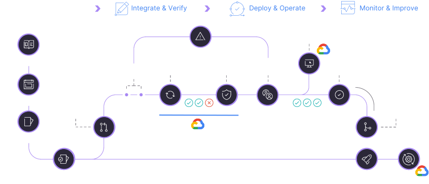

<div style="display:flex; flex-direction:column;">
    <h1 style="margin-bottom:0.5em; margin-top:1em">
        GitLab on GCP
    </h1>
    <div style="display:flex; flex-direction:row;">
        <div style="display:flex; flex-direction:row">
            <div>
                
            </div>
            <div style="display:flex; flex-direction:column; justify-content:center; margin-left:1em">
                <h2>
                    Christoph Leygraf
                </h2>
                <h6>
                    Channel Solutions Architect
                </h6>
            </div>
        </div>
        <div style="display:flex; flex-direction:row; margin-left:2em">
            <div>
                
            </div>
            <div style="display:flex; flex-direction:column; justify-content:center; margin-left:1em">
                <h2>
                    Péter Bozsó
                </h2>
                <h6>
                    Channel Solutions Architect
                </h6>
            </div>
        </div>
    </div>
</div>

---

## Communaltities

<div class="content-container">
    <div class="content">
        <div style="font-size:70px"><h2><span style="color:#fc6d26;font-size:130%"><b>G</b></span>itLab</h2></div>
        <div style="font-size:70px"><h2><span style="color:#4285F4;font-size:130%"><b>G</b></span>oogle Cloud</h2></div>
    </div>
</div>

___

## What is a PaaS?

According to [Wikipedia](https://en.wikipedia.org/wiki/Platform_as_a_service):

> Platform as a service (...) is a category of cloud computing services that allows customers to provision, instantiate, run, and manage a modular bundle comprising a computing platform and one or more applications, without the complexity of building and maintaining the infrastructure typically associated with developing and launching the application(s), and to allow developers to create, develop, and package such software bundles.

According to us:

```ts
import { PaaS } from 'gitlab-gcp-presentation-sdk';

console.log(PaaS.expand()); // Output: 'Presentation as a Service'
```

---

## What is a PaaS?

According to [Wikipedia](https://en.wikipedia.org/wiki/Platform_as_a_service):

> Platform as a service (...) is a category of cloud computing services that allows customers to provision, instantiate, run, and manage a modular bundle comprising a computing platform and one or more applications, without the complexity of building and maintaining the infrastructure typically associated with developing and launching the application(s), and to allow developers to create, develop, and package such software bundles.

According to us:

```ts
import { PaaS } from 'gitlab-gcp-presentation-sdk';

console.log(PaaS.expand()); // Output: 'Presentation as a Service'
```

<div class="red-stamp"><p>WRONG!!!</p></div> 

---

## For today it's ...

<div class="content-container">
    <div class="content">
        <h2><span style="color:#fc6d26;font-size:130%"><b>P</b></span>resentation</h2>
        <h2><span style="color:#fc6d26;font-size:130%"><b>A</b></span>s</h2>
        <h2><span style="color:#fc6d26;font-size:130%"><b>A</b></span></h2>
        <h2><span style="color:#fc6d26;font-size:130%"><b>S</b></span>ervice</h2>
    </div>
</div>

---

## GitLab &#x1F9E1; Google Cloud



---

## Production PaaS App


<!-- footer: ##URL-PROD## --->

---

## GitLab Review App


<!-- footer: ##URL-REVIEW## --->

---


<div style="height:100%; display:flex; flex-direction:column; justify-content:center;">
    <h2>
        Thank you!
    </h2>
    <br>
    <h4>
        Friendly reminder: from now on, <span style="color:#fc6d26;font-size:100%"><b>PaaS</b></span> is <i><span style="color:#fc6d26;font-size:100%"><b>P</b></span>resentation <span style="color:#fc6d26;font-size:100%"><b>a</b></span>s <span style="color:#fc6d26;font-size:100%"><b>a</b></span> <span style="color:#fc6d26;font-size:100%"><b>S</b></span>ervice.</i>
    </h4>
</div>

<!-- footer: "https://about.gitlab.com/" -->
