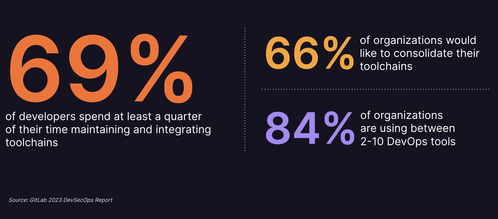
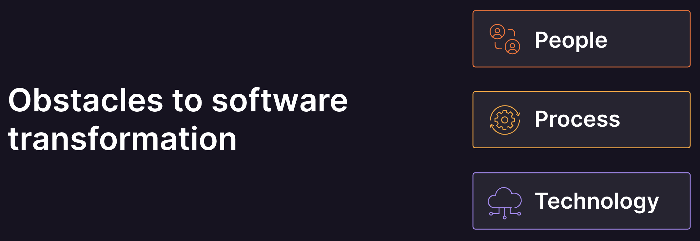
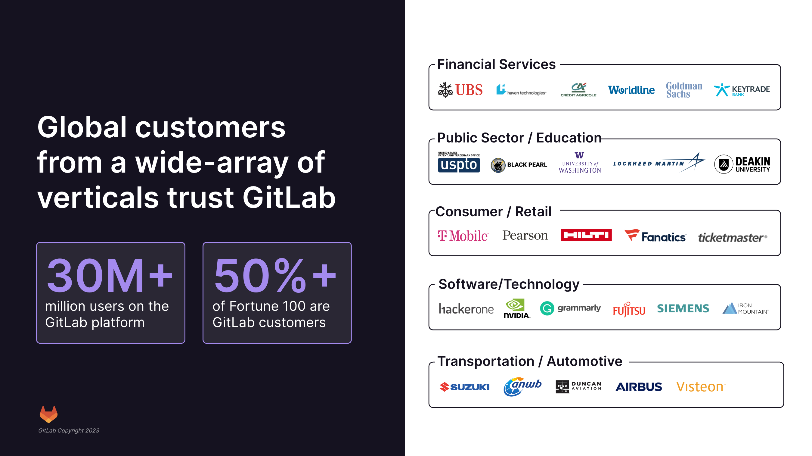
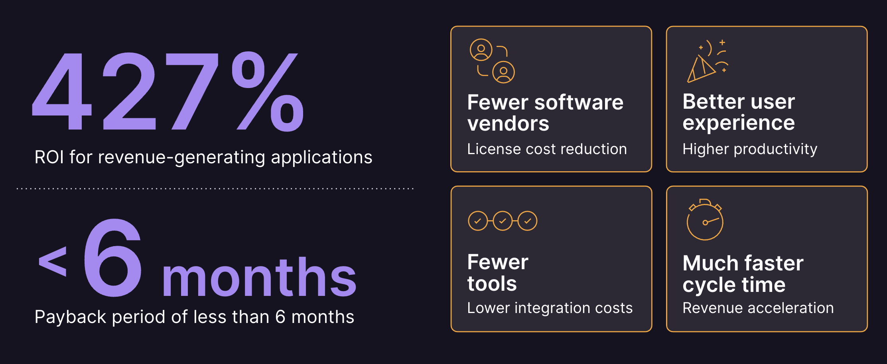
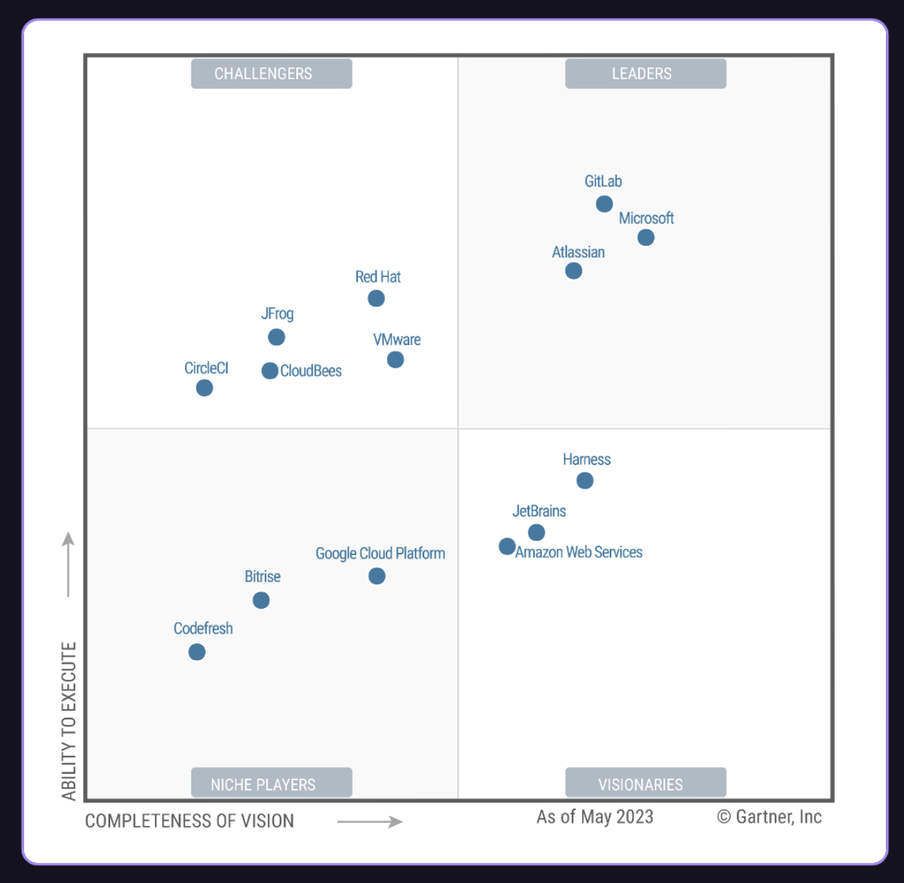
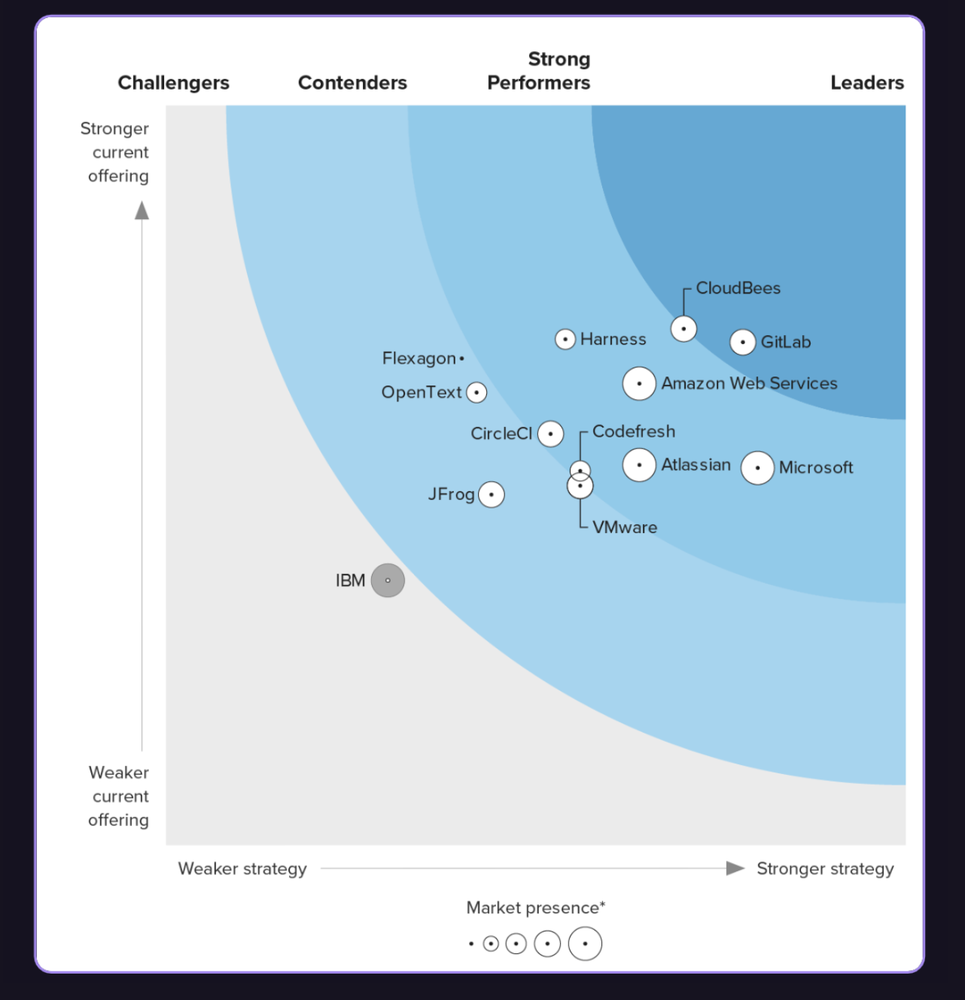
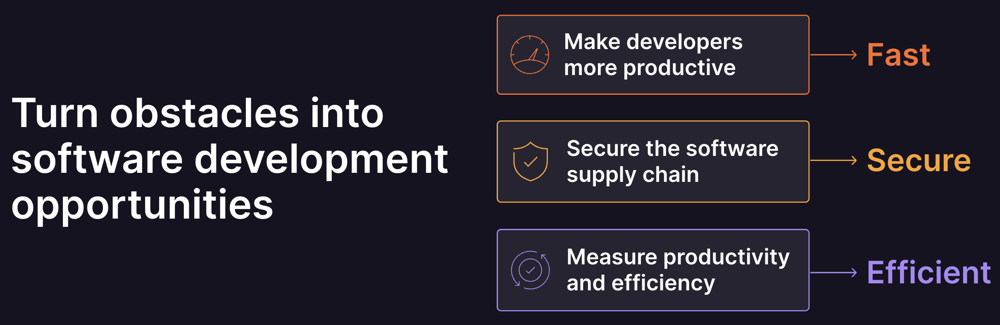
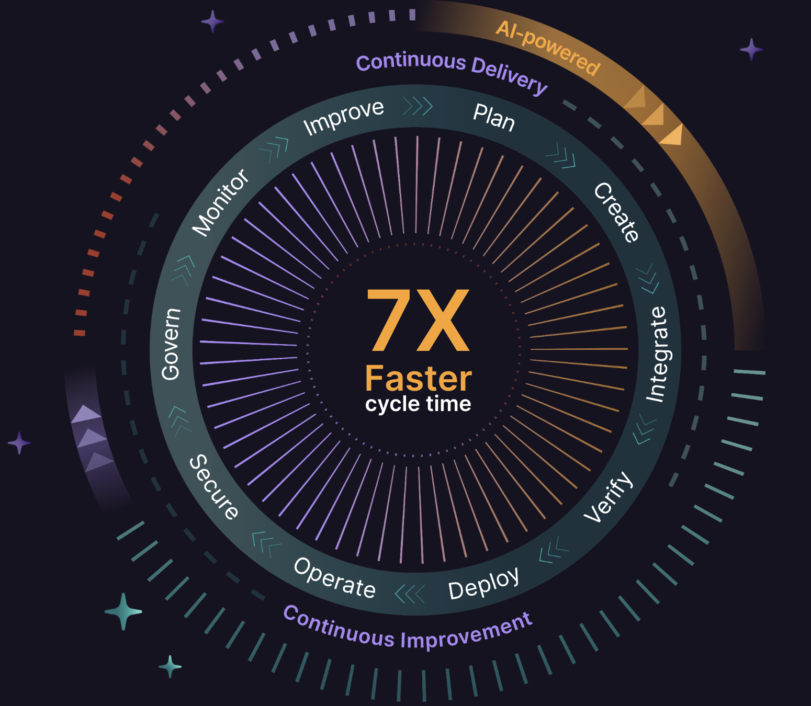
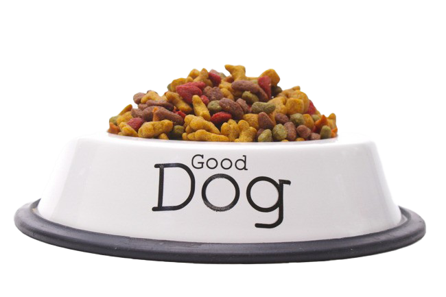

    <h1 style="margin-top:1em;text-align:right;color:#fc6d27">
      ##WHY_TITLE##
    </h1>
    <h2 style="margin-bottom:1.5em;text-align:right;">
      ##SUBTITLE##
    </h2>
    

        

            

                
            

            

                <h2>
                    Christoph Leygraf
                </h2>
                <a href= "mailto:cleygraf@gitlab.com">cleygraf@gitlab.com</a>
            

        

        

        

    

<!-- footer: "" -->
---
<!-- header: ""  --> 

---

Cars?

---

---

---
<!-- header: "" -->

And Software?

<!-- footer: "" -->
---
<!-- header: "GitLab's Software Factory Approach" -->

- Ideas go in, applications come out
- Shift security left: checks at each stage
- Full visibility from planning to production

<!-- footer:  -->
---
<!-- header: "Growing complexity in DevSecOps"  --> 

<!-- footer:  -->
---
<!-- header: "The Problem"  --> 

<!-- footer:  -->
---
<!-- header: ""  --> 

<!-- footer:  -->
---
<!-- header: "The Solution"  --> 

<!-- footer:  -->
---
<!-- header: "The Result"  --> 

<!-- footer:  -->
---
<!-- header: "" -->

Code Suggestions

<!--
Reference:
- As of Nov 2023 14 coding languages are supported
- [Supported coding languages](https://cloud.google.com/vertex-ai/docs/generative-ai/code/code-models-overview#supported_coding_languages) 
- For code completion the `code-gecko` code model is required.
- [Code Suggestions on self-managed GitLab](https://docs.gitlab.com/ee/user/project/repository/code_suggestions/self_managed.html)
-->
<!-- footer:  -->
---
<!-- header: "" -->

39%

<!--
39% of time spending working with code / 52 minutes of code time per day

Sources (as of May 3rd 2023):
- https://www.software.com/reports/code-time-report#developers-code-less-than-one-hour-per-day-
-->
<!-- footer:  -->
---
<!-- header: "" -->

52 minutes

<!--
39% of time spending working with code / 52 minutes of code time per day

Sources (as of May 3rd 2023):
- https://tidelift.com/subscription/managed-open-source-survey?utm_source=thenewstack&utm_medium=website&utm_content=inline-mention&utm_campaign=platform
-->
<!-- footer:  -->
---
<!-- header: "AI powered - in every step & for every user"  --> 

<!-- footer:  -->
---
<!-- header:   -->

### AI-assisted workflows for everyone in the software development lifecycle

 Throughout the Software Delivery Lifecycle
 Privacy and transparency first  
 Best in class models

---
<!-- header: ""  --> 

<!-- footer: "" -->
---
<!-- header: ""  --> 

<!-- footer: "" -->
---
<!-- header: "Significant ROI and short payback period"  --> 

<!-- footer:  -->
---
<!-- header: "GitLab Recognized as a Leader"  --> 

<!-- footer: 2023 Gartner® Magic Quadrant™ for DevOps Platforms  -->
---
<!-- header: "GitLab Recognized as a Leader"  --> 

<!-- footer: 2023 Forrester Wave™ for Integrated Software Delivery Platforms -->
---
<!-- header: ""  --> 

<!-- footer:  -->
---
<!-- header:  "" -->

# Software.

# Faster.

<!-- footer: "" -->
---
<!-- header:  "" -->

# Thank you

<!-- footer: "" -->
---
<!-- header: "" -->

One more thing ...

<!-- footer:  -->
---
<!-- header:  "Dogfooding" -->

<!--
References: 
- [Dogfooding for Product Managers](https://about.gitlab.com/handbook/product/product-processes/dogfooding-for-product-mgt/)
- [Engineering Principles - Dogfooding](https://about.gitlab.com/handbook/engineering/development/principles/#dogfooding)
-->
<!-- footer: "" -->
---
<!-- header:  "This slides" -->

<!-- footer: ##URL_WHY_PROD## --->
---
<!-- header:  "GitLab Project" -->

<!-- footer: "##URL_PROJ##" -->
---
<!-- header:  "GitLab Flow" -->

<!--
References: 
- [Combine GitLab Flow and GitLab Duo for a workflow powerhouse](https://about.gitlab.com/blog/2023/07/27/gitlab-flow-duo/)
-->
<!-- footer:  -->
