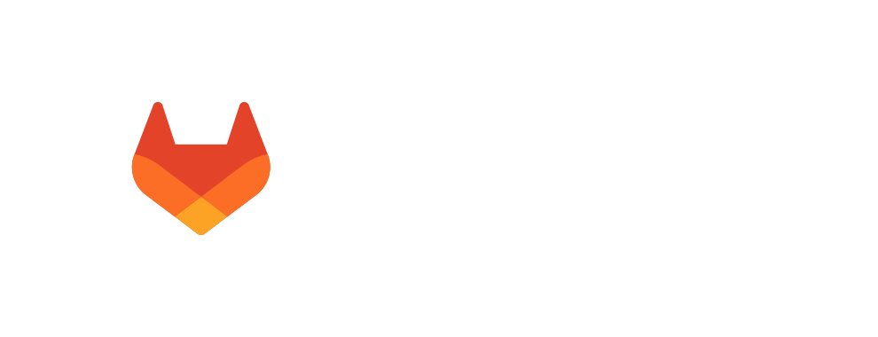

    <h1 style="margin-top:1em;text-align:right">
      <b>Why  GitLab?</b>
    </h1>
    <h2 style="margin-bottom:1.5em;text-align:right;">
      2023-11-06
    </h2>
    

        

            

                
            

            

                <h2>
                    Christoph Leygraf
                </h2>
                <a href= "mailto:cleygraf@gitlab.com">christoph@leygraf.de</a>
            

        

        

        

    

<!-- footer: "" -->
---
<!-- header: ""  --> 

---

Cars?

---

---

---
<!-- header: "" -->

And Software?

<!-- footer: "" -->
---
<!-- header: "GitLab's Software Factory Approach" -->

- Ideas go in, applications come out
- Shift security left: checks at each stage
- Full visibility from planning to production

<!-- footer:  -->
---
<!-- header: "Growing complexity in DevSecOps"  --> 

<!-- footer:  -->
---
<!-- header: "The Problem"  --> 

<!-- footer:  -->
---
<!-- header: "The Solution"  --> 

<!-- footer:  -->
---
<!-- header: "GitLab: A single AI-powered application"  --> 

<!-- footer:  -->
---
<!-- header:   -->

### AI-assisted workflows for everyone in the software development lifecycle

 Throughout the Software Delivery Lifecycle
 Privacy and transparency first  
 Best in class models

---
<!-- header: "AI powered - in every step & for every user"  --> 

<!-- footer:  -->
---
<!-- header:  "" -->

    <h2>
        Thank you!
    </h2>
     
    <h4>
        Friendly reminder: from now on, <b>PaaS</b> is <i><b>P</b>resentation <b>a</b>s <b>a</b> <b>S</b>ervice.</i>
    </h4>

<!-- footer: "https://about.gitlab.com/" -->
---
<!-- header:  "Useful links?" -->

 [GitLab 2023 Global DevSecOps Report Series](https://about.gitlab.com/developer-survey/)

 [GitLab Duo](https://about.gitlab.com/gitlab-duo/)

 [AI/ML in DevSecOps Series](https://about.gitlab.com/blog/2023/04/24/ai-ml-in-devsecops-series/)

 [GitLab and Google Cloud AI Partnership](https://about.gitlab.com/press/releases/2023-05-02-gitLab-and-google-cloud-partner-to-expand-ai-assisted-capabilities.html)

 [GitLab on Google Cloud](https://about.gitlab.com/partners/technology-partners/google-cloud-platform/)

 [... even more GitLab related links](./links.html)

<!-- footer:  -->
---
<!-- header:  "<b>Updated</b> Production PaaS App" -->

<!-- footer: Still the same URL: ##URL_PROD## --->
---
